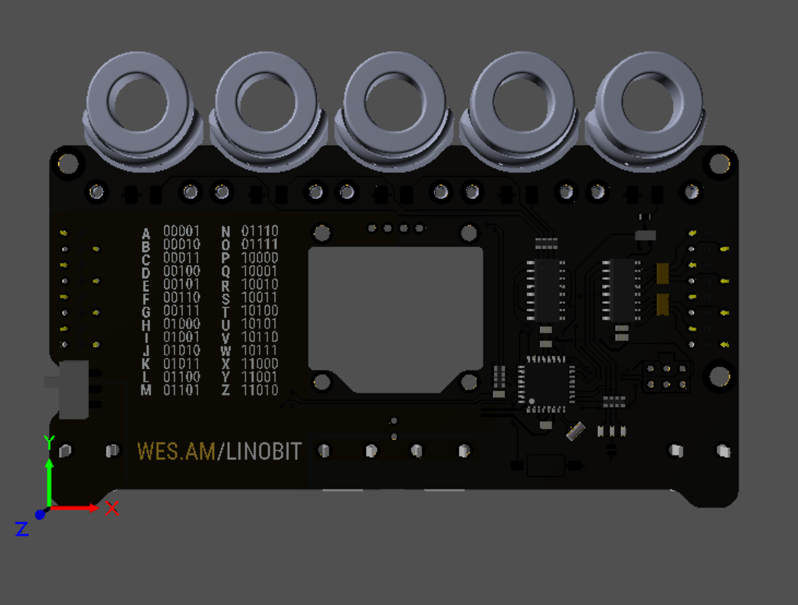

# Linobit
## A recreational core rope ROM device

### Abstract:

This paper explores the decision making process of designing Linobit, a scaled down and portable version of "Linobyte - A core rope ROM based experiment". From the exploration of the technical aspects of the original core ROM devices from the 60s to the functionality and decisiosn regarding modern circuitry.

#### DESCRIPTION AND MOTIVATION
As computational devices evolve, more tools and interfaces are built between the user and the machine. This allows us to complete increasingly complex tasks without having to focus so much on understanding the nuances of the machine. While this movement is certainly overall positive, one of the drawbacks is that people no longer learn the fundamental processes and concepts which allow the tool to work. Added to that, by neglecting history, we forget the alternatives of the technologies that we use today - forgotten alternatives that maybe once were the status quo. Understanding of those alternatives would give us a broader view of the pros and cons of what we have today, how they superseded their ancestors and what are their pitfalls - important knowledge for those who design possible futures.

Its with these preocupations in mind that Linobyte came into existence. It conciliates the explanation of how bits, bytes and chars work, with a hands on experience of creating Core Rope ROMs: read-only memories that were written by weaving an enameled copper wire through ferrite cores.

### HOW TO USE IT
The whole process is quite straightforward, and the result is immediate: the user can write up to 8 characters. Each character consists of one eight-bit byte. Each core represents one bit, and by weaving the conductive wire through the core center, the user sets a bit as positive. By skipping the core, its set as zero. 

So, if the user wants to write the “A” character, the steps should be the following:

Find out the binary value in ASCII of the “A” character by checking on the ASCII table (provided with the device): “A” in ASCII is  01000001 in binary.
Figure out which bits have to be set in the “Char” board: the first bit (least significant), or bit 0. And the seventh bit, bit 6.

Weave a wire through the respective coils: zero and six.

Check the character on the display and proceed to the next character.

### First prototype:

### DESIGN, FABRICATION AND DOCUMENTATION
As important as the device in itself, is the documentation of how it came into existence. The blueprints and schematics not only allow the device to be better understood and even reproduced, but they also give insight into the design decisions that give the object its character.

Documentation was made in three main levels: 

#### 1 - Usage
This gives a brief introduction of how the device is used, and thus a very clear and immediate visualization of cause/effect in core rope ROMs. While this does not provide a technical explanation of how it works, it gives a fast point of correlation for the public in general to start decoding its workings.

#### 2 - Making of
This goes through the process of designing, fabricating and assemblying Linobyte, in a step-by-step, quick and visually enticing manner. For those who had some interest in the device, this provides a bit more background on its construction, and allows for a slow and steady movement into more technical and specific information.

#### 3 - Online repository
This is where the full documentation of Linobyte lies. Descriptions of all the main decisions and the comprimises that were taken or not,  technical and historical references, design files and similar projects.

Those who are really interested in any aspect of the project can find more information here and most likely threads which he/she can follow towards other types of interfaces and memories.

### HISTORY AND TECHNICAL INFORMATION

#### Introduction to Core Rope ROMs

Core Rope Read Only Memories were devices used by computers in the 60s and 70s to store permanent information. They were a fast and robust alternative to other memories of the time (punched cards and ) and were used in historically famous computers such as the AGC - Apollo Guidance Computer. In the case of space bound applications, the ruggedness of Core Rope ROMs against cosmic radiation made them a reliable choice. Despite these positive aspects though, they were extremely labourious to build - the information was encoded through hand winding of an enameled copper wire into ferrite toroids. (It was referred to as "LOL" memory by MIT programmers: Little Old Lady memory). It was such a labourious process that during the development process they had "Core rope ROM Simulators", devices where they would encode the prototypal information to test the final computer.

#### Downsizing Linobyte

Linobyte was developed in the context of Media Archeology class

It features 8 bytes with 8 bits each, which can represent an 8 character word, and therefore is quite relatable to the general public. However, this makes it quite complex and expensive to reproduce, and the multiple functional blocks make it hard to understand in a quick glance. 

In addition, a brute force approach was used in the coil write and read blocks. There is a permanent oscillator on the main board, which drives individual character blocks as soon as they are enabled. This approach was used to allow Linobyte to operate in an assynchronous manner: the pulses of the oscillator are not synched with any set, write or reset operation. This approach allowed for greater flexibility in the design stages: the logic process did not have to be defined yet. The usage of highly integrated modern chips also helped that (I2C GPIO expanders instead of shift registers and latches, etc). 

In essence, while it is a nice illustration of the working principle of the coil and magnetic part of Core Rope ROMs - weave a wire to set a bit - it disregards many of the working principles of the circuitry logic of the time.

Linobit was born to address these issues, striping down unnecessary and redundant power circuits, replacing modern ICs with with more fundamental logic, reducing the amount of coils, and using initially no microcontrollers.

In Linobit, since the amount of coils is greatly reduced (from 64 to 4) it is easier to experiment with latches and syncronous execution processes. Therefore, the coil is not driven by an oscillator that is permanently on but instead by a single pulse that is triggered by the press of the button. The pulse then passes through the transformers that are "set" and sets the latches on the secondary side. Instead of the linobyte approach of using a rectifier charging a capacitor - needing multiple pulses to reach the trigger level - the rectifier triggers the SR Latch with a single pulse. (This was the approach used in the Apollo Guidance Computer, as the schematics indicate:)

In essence while Linobyte works as a device in smaller contexts with more intimate publics, its not built for public or participatory exhibitions due to its complexity.

----------------------------------------------------------------------------------------------------------------

#### Number of coils and display

The number of coils was the first decision for Linobit. While 8 is a nice amout of coils to represent a byte, its more than necessary to represent the concept. 1 is enough to represent the principle of setting a bit, but does not touch that well the process of encoding information. 3 was considered to drive a 3 to 8 decoder and 7 segment display, however when counting, it only goes up to 8, so doesn't represent all the decimal numbers. 4 is enough to represent all decimal numbers, however there are invalid combinations: 1111 for example is 15 in decimal which isnt representable anymore in a 7 segment display. It is 0xF in HEX, which can be represented in a 7 segment display, but I decided not to use HEX encoding because most people aren't familiar with it. So although 4 bits has some excess, the ability of using the whole decimal range is nice, hence it was chosen instead of just 3. (Also, its half of a common 8 bit byte, so 2 linobits can make a byte with no excess). 

Explain why 7 segment displays

#### Coil read block

As mentioned, a brute force approach was used in driving and reading the coils in Linobyte, so a more elegant and efficient approach was desired. A very desirable solution to read the coils would be a circuitry that receives a fast pulse - so that when driving the coils a single pulse is enough - and whose output can be held high after the pulse is received for a long time - so that the block that after that does not have to be set by a fast and low power pulse. 

An SR Latch does exactly that. It has two inputs, SET and RESET. Whenever the SET receives a high input, it holds the output high until the RESET input is triggered. 

## Functional Blocks

### Coil Drive

The coils are driven by __?__

### SR Latch

SR stands for SET and RESET, that are the two inputs on this circuit. It is composed of two NOR gates, which in the case of Linobit, I have decided to build discretely (instead of using integrated circuits). The SET input is connected to the output of the rectifier, and the RESET is connected to a button controlled by the user.

The way an SR Latch works is: as soon as the SET output receives a positive pulse from the cores, its output will stay high until the reset part receives a positive pulse. This way you can set a bit high with the coil with a single pulse (instead of needing multiple pulses as in linobyte).

The output of this circuit is connected to a 4 to 10 BCD to 7 segment converter IC.

### 4 to 10 BCD to 7 Segment display

The role of this block is to convert a 4-bit input to a decimal number represented by a segment display. The initial plan was to use a purpose built BCD to 7 segment IC, such as ___?___ (https://www.ti.com/lit/ds/symlink/sn7447a.pdf). This has now changed to an Atmega328 - the chip used in an Arduino, so that the truth table is implemented in firmware. While this is a detraction from the initial "No ICs" plan, the addition of a microcontroller and the implementation of the truth table in firmware (instead of hard wired into the decoder IC) adds a learning opportunity and some space for tweaks and hacks.

### Power management

Power management is relatively simple, there are three main functions: turn on power when the SET button is pressed, turn off power when the microcontroller toggles the power pin, and prevent reverse current to flow into the batteries when external power is applied. This is done with two main functional blocks:

1 - Reverse current protection FET

2 - Power on latch

### References

MIT Science Reporter—"Computer for Apollo" (1965)
https://www.youtube.com/watch?v=ndvmFlg1WmE

### Julia Feedback

The priority is to make the core rope rom more transparent, not the screen

Ratio of transistors per black box: 4:1 for SR Latch, 80:1 for 4-10 decoder

